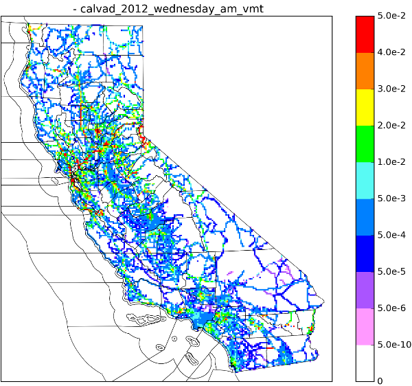
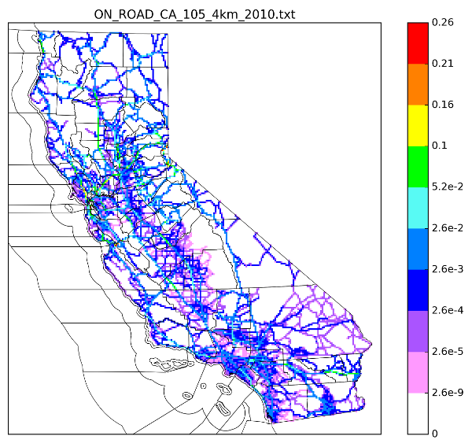
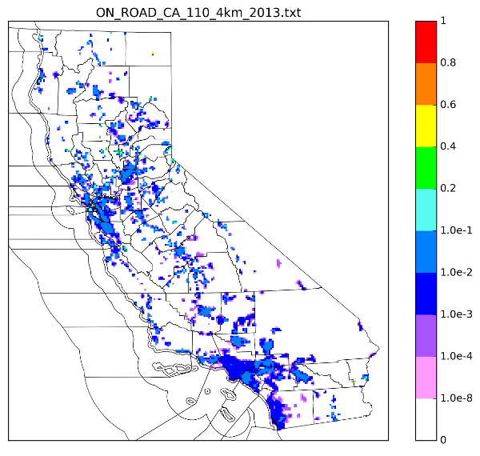
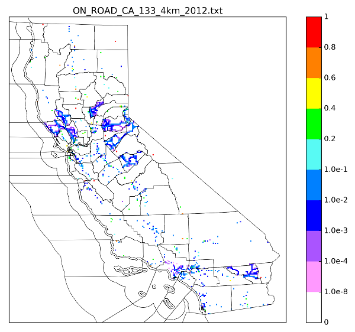

# ESTA Surrogate Documentation

ESTA is a gridding model that takes raw emissions and applies spatial and temporal surrogates. Of course, ESTA users can include any new spatial or temporal surrogates they want in their modeling. But, several spatial surrogates are included in ESTA for gridding on-road emissions in California. And since they are included with the model, they should be explained. This page describes all the spatial and temporal surrogates included in ESTA by default, where they came from, and what their purpose.

## Table of Contents

* [Spatial Surrogates](#spatial-surrogates)
  - [DTIM On-Road Spatial Surrogates](#dtim-on-road-spatial-surrogates)
  - [ARB On-Road Spatial Surrogates](#arb-on-road-spatial-surrogates)
    + [Calvad VMT by Day-of-Week and Period](#calvad-vmt-by-day-of-week-and-period)
    + [Linehaul](#linehaul)
    + [City Population](#city-population)
    + [Distribution Centers](#distribution-centers)
    + [Idling Locations](#idling-locations)
    + [30 Idle - 70 Dist](#30-idle---70-dist)
    + [90 Idle - 10 Dist](#90-idle---10-dist)
* [Temporal Surrogates](#temporal-surrogates)
  - [Calvad-Based On-Road Temporal Surrogates](#calvad-based-on-road-temporal-surrogates)

## Spatial Surrogates

Several spatial surrogates are included in ESTA. These are all examples of on-road spatial surrogates designed to disaggregate EMFAC emissions on the California modeling grid. They are divided into two cases: one for a simple DTIM-like run and a second for a more modern simultation using a wider variety of data sources.

### DTIM On-Road Spatial Surrogates

TODO

### ARB On-Road Spatial Surrogates

ARB uses several spatial surrogates when modeling on-road emissions. Most of these surrogates come real, measured traffic data from the [Calvad database](http://www.its.uci.edu/research) to distribute VMT-based on-road emissions across the modeling grid. Though for linehual trucks the [CalTrans CSTDM](http://www.dot.ca.gov/hq/tpp/offices/omsp/statewide_modeling/cstdm.html) data was used, as it was believed to be a more cohesive view of the VMT for those vehicle types.  Unlike previous on-road models, ESTA also includes a series of spatial surrogates for the non-moving emissions from on-road vehicles: starting and resting emissions.

#### Calvad VMT by Day-of-Week and Period 

The [Calvad database](http://www.its.uci.edu/research) uses a variety of real-life traffic measurements to build a real picture of the traffic at the link-level across California.  Because the CalTrans database uses real, measured traffic data, it is an extremly desirable ground-truth data set.  But it does not include a lot of data about the vehicle types in traffic, as it is more expensive to collect that sort of data.  Since the number of wheel axis were recorded for each measured vehicle, it was determined that heavy-heavy-duty vehicles (HHDV) could easily be subtracted from the data set, leaving a very representative sample for light-duty vehicles (LDV) and light-medium-duty vehiles (LMDV).

Because the real-life nature of Calvad data makes the hourly variation quite messy, it was decided to use spatial surrogate for each of four daily time periods (matching those in the [CalTrans CSTDM](http://www.dot.ca.gov/hq/tpp/offices/omsp/statewide_modeling/cstdm.html) modeling):

* off peak: 6 AM to 10 AM
* midday:   10 AM to 3 PM
* pm peak:  3 PM to 7 PM
* off peak: 7 PM to 6 AM

Spatial surrogates were averaged from the entire 2012 data set, for eight different representative days:

* Monday
* Tuesday
* Wednesday
* Thursday
* Friday
* Saturday
* Sunday
* Holiday

Thus, between the four time periods and eight days, ARB uses 32 Calvad-based VMT spatial surrogates when griding EMFAC on-road emissions.

Here is an exmample plot of the Calvad-based VMT surrogate for Wednesdays in California in 2012, during the "AM Peak" (or "Morning Rush Hour"):

#### Linehaul

The [CalTrans CSTDM](http://www.dot.ca.gov/hq/tpp/offices/omsp/statewide_modeling/cstdm.html) is a link-level travel-demand model, run every five years using a huge variety of real data.  To produce a spatial surrogate for linehaul vehicles, the 2010 CSTDM outputs were obtained. Then, in ArcMap, the V10 vehicle class was extracted for all links labeled as "major highway", and these links were weighted by VMT.  

The result is probably the most reliable VMT spatial surrogate for linehaul vehicles that has ever been produced for California:

#### City Population

Some on-road emissions are best distributed by human population. For instance, the multi-day diurnal resting loss from LDV traffic is probably best distribution by human population, or the number of households. The idea being that these emissions are spatially distributed by where personal cars are stored, and they are not really present on highways.

Older models, like DTIM, tried to use Census data to locate these emissions. But Census data is done by "traffic analysis zone" or "census tract". And in rural or mountainous regions these areas can be as big as a whole county, and this ruins the spatial allocation entirely.

To improve upon this, 2012 Census information on the number of households in each city was taken for the several hundred cities in California. That information was added to an ArcGIS shapefile of the city boundaries. The result was a shapefile that represents the population in cities. This file had to be edited slightly as the legal boundaries of coastal cities extend into the ocean three miles, which is inappropriate for on-road vehicle emissions. The ocean areas were trimmed off and the shapefile was weighted by the number of households per square area to create our "City Population" spatial surrogate:

#### Distribution Centers

This surrogate is not used directly as an ESTA default, but rather as part of combined surrogates.

The Distribution Centers surrogate data set was originally the work of Cheryl Taylor at the ARB, along with several stakeholders in the California SIP Inventory Working group. In 2015, Cheryl accessed the data from ARB Equipment Registration (ARBER) data set. ARBER is an online registration program for the Transportation Refrigeration Unit and the Drayage Truck Regulations. In cooperation with Carolyn Craig and Rich Boyd of the ARBER team, a shapefile was created that included all kinds of distribution centers in California which might have HDV traffic. 

#### Idling Locations

This surrogate is not used directly as an ESTA default, but rather as part of combined surrogates.

The data for this surrogate came from two sources:

1. The US EPA's "idling locations" dataset. This was retrieved from their FTP servers in early April, 2016 as a shapefile.
2. The CalTrans "rest stops" dataset. This was retrieved as a shapefile from their website: http://www.dot.ca.gov/hq/tsip/gis/datalibrary/Metadata/RestArea.html

Many duplicate locations were found between the two datasets, and had to be removed. The results were originally combined into a shapefile. To help weight which locations had more traffic then others, a detailed, manual hand-count was undertaken on Google Earth. The number of parking spots available, big enough for a single linehaul truck with trailer, were counted for each and every location from each of the above two data sets. The process was laborious, but yielded a shapefile that could be easily weight by the number of parking spots in each location.

The number of parking spots was determined to be the best way to represent how active an individual idling location or rest stop may be. This is thought to be the most analytical and complete comparison possible until such a time as extensive measurements are made of idling time at all of California's linehaul truck idling locations.

#### 30 Idle - 70 Dist

This surrogate is simply a weighted sum of 30 percent of the Idling Locations surrogate above with 70 percent of the Distribution Centers surrogate above. In counties or GAIs where neither surrogate has any value, the missing data is filled in with the CalTrans CSTDM linehaul trucking surrogate.

The 30/70 split was derived from the data on [this page](http://energy.gov/eere/vehicles/fact-917-march-21-2016-work-truck-daily-idle-time-industry) of the energy.gov website.

This was used as a reference because the EMFAC team also used it as a reference, and it is useful that both models have the same underlying assumptions. The 30/70 split itself was derived by taking a weighted average of the time spent idling in different locations, across all non-line-haul heavy-duty vehicle types. This turned out to be about 24-32%, for different HD trucks. So this is the time-split between how much idling is done at the kinds of places line haul trucks idle versus other locations, like distribution centers.

#### 90 idle - 10 dist

This surrogate is simply a weighted sum of 90 percent of the Idling Locations surrogate above with 10 percent of the Distribution Centers surrogate above. In counties or GAIs where neither surrogate has any value, the missing data is filled in with the CalTrans CSTDM linehaul trucking surrogate.

This 90/10 split was designed to match the EMFAC2014 assumption that nearly all of the idling done by linehaul trucks happens at places like truck stops. This is because line haul truckers can, and frequently must, sleep in the cab of their vehicle with the engine running in an idling mode.

There is some discussion of whether 90/10 or 95/5 is a better split for this surrogate. Perhaps this will change in the future versions of EMFAC. If so, it will be changed to match in ESTA.

## Temporal Surrogates

Several temporal surrogates are included in ESTA. These are all examples of on-road temporal surrogates designed to disaggregate daily EMFAC emissions into hourly periods.

### Calvad-Based On-Road Diurnal Temporal Surrogates

The [Calvad database](http://www.its.uci.edu/research) uses a variety of real-life traffic measurements to build a real picture of the traffic at the link-level across California.  Because the CalTrans database uses real, measured traffic data, it is an extremly desirable ground-truth data set.  But it does not include a lot of data about the vehicle types in traffic, as it is more expensive to collect that sort of data.  Since the number of wheel axis were recorded for each measured vehicle, it was determined that heavy-heavy-duty vehicles (HHDV) could easily be subtracted from the data set, leaving a very representative sample for light-duty vehicles (LDV) and light-medium-duty vehiles (LMDV).

Spatial surrogates were averaged from the entire 2012 data set, for six different representative days:

* Monday
* Tuesday-Wednesday-Thursday
* Friday
* Saturday
* Sunday
* Holiday

Thus, it was possible, for every county / GAI in California to generate a 24-hour diurnal profile for three different vehicle categories and six different representative days of the week; for a total of 18 different temporal surrogates.

Upon discussion with the EMFAC team it was discovered that the EMFAC model assume that school busses only run for three hours in the morning and three hours in the evening on non-holiday weekdays. To keep the two models as closely relatable as possible, a fourth vehicle type was added to these above Calvad surrogates, matching this temporal profile. This leads to the final 30 on-road diurnal surrogates found in the ESTA model, for each GAI in the state.

### Calvad-Based On-Road Day-of-Week Temporal Surrogates

Similar to the diurnal surrogates described above, day-of-week surrogates were bulit from the VMT recorded in the Calvad database. The reason day-of-week surrogates are needed is because the EMFAC model only estimates on-road emissions for "average weekday" traffic. This is taken to mean the VMT used in EMFAC represents the average Tuesday, Wednesday, or Thursday. However, holidays frequently have far less traffic, and Fridays frequently have far more.

To accurately model on-road emissions, each Calvad vehicle class VMT was summed for all road network links in each GAI, by day-of-week. Then fractions were made for each day-of-the-week relative to the EMFAC representative Tuesday-through-Thursday. These fractions are then used to manual raise or lower the on-road emissions calculated by EMFAC to better match day-of-week traffic patterns.

Again, a minor change was made so that the school bus vehicle category has zero emissions on weekends and holidays.
